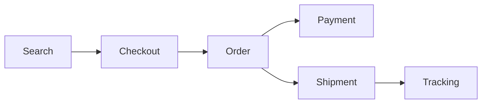

# Logistics Marketplace

Reference architecture for a marketplace logistics platform, built to demonstrate real distributed-systems decisions: microservices, Kafka, sagas, idempotency, observability, and data ownership.

[:material-map-outline: Explore the architecture](contracts/services-map.md){ .md-button .md-button--primary }
[:material-github: View the repository](https://github.com/leandrosflora/logistica-marketplace-demo-arch){ .md-button }

## Overview

## Pillars

-   :material-transit-connection-variant:{ .lg .middle } **Event-Driven Architecture**

    ---

    Kafka connects domains and reduces coupling, with governed contracts and schema evolution.

    [Kafka events](contracts/kafka-events.md)

-   :material-state-machine:{ .lg .middle } **Saga and reliability**

    ---

    Orders coordinate reservations, payment, and shipment through compensations, Inbox/Outbox, and idempotency.

    [Order saga](services/order-service.md)

-   :material-database-lock:{ .lg .middle } **Data ownership**

    ---

    Each service owns its database, schema, and cache. Integrations happen through explicit APIs and events.

    [Data map](contracts/data-stores.md)

-   :material-chart-timeline-variant-shimmer:{ .lg .middle } **End-to-end observability**

    ---

    Logs, metrics, and traces correlate the journey across REST APIs, Kafka consumers, and Kafka producers.

    [Observability](devops/observability.md)

## Main journey

The documentation covers the happy path, alternative scenarios, failures, and compensations. See the [detailed journeys](sequence-diagrams/README.md).

## Stack

| Capability | Technology and pattern |
|---|---|
| APIs and services | .NET 8, C#, REST, hexagonal architecture |
| Events | Apache Kafka, versioned contracts |
| Persistence | PostgreSQL and Redis |
| Reliability | Saga, Inbox/Outbox, and idempotency |
| Observability | OpenTelemetry, Prometheus, Grafana, Loki, and Jaeger |
| Local execution | Docker Compose |

!!! info "Architecture repository"
    This project centralizes contracts, decisions, diagrams, and operational guides. Service code is distributed across the related repositories listed in the [service map](contracts/services-map.md).
